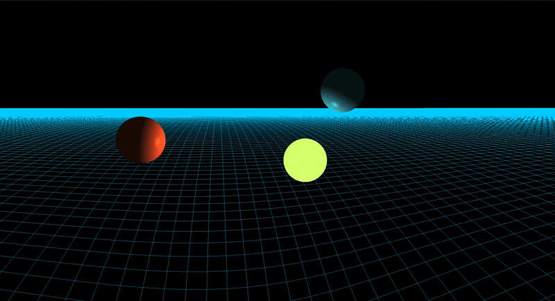
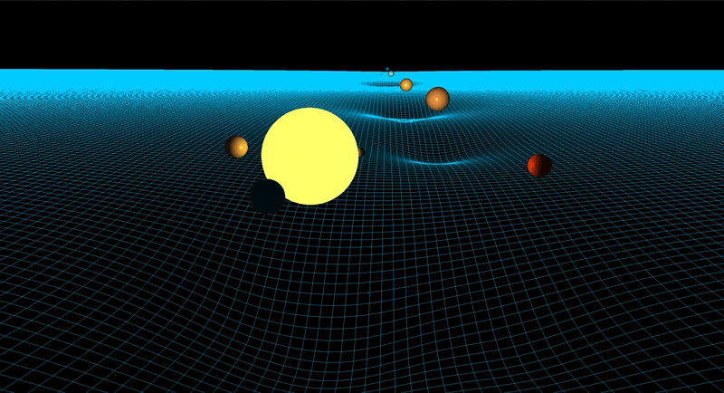

# N-Body Simulation

A Barnes-Hut N-body gravity simulator in Java with an OpenGL renderer, built to
explore how a hierarchical approximation trades accuracy for speed — and to
measure that trade rather than assume it.

[](https://github.com/LuisC733/N-Body-Simulation/actions/workflows/build.yml)



## What it does

Bodies attract each other under Newtonian gravity. Rather than evaluating all
N² pairs, the simulator builds an octree each step and approximates distant
clusters by their centre of mass, giving sub-quadratic scaling at a controlled
accuracy cost. Integration uses velocity Verlet, which is symplectic and so
keeps energy bounded over long runs instead of drifting.

Three scenes ship with it:

| Scene | Command | What it shows |
|---|---|---|
| `solar` | *(default)* | Sun and eight planets, started at aphelion |
| `eight` | `-Drun.scene=eight` | Chenciner–Montgomery figure-eight, three equal masses on one closed curve |
| `disc` | `-Drun.scene=disc` | Seeded random disc, also used headless for the scaling benchmark |



The figure-eight doubles as a visual regression test: the curve only stays
closed if the integrator is correct.

## Running it

Requires JDK 21 and Maven. Native libraries are selected automatically for
Linux, macOS and Windows on both x86-64 and ARM.

```bash
mvn compile exec:exec                                      # solar system
mvn compile exec:exec -Drun.scene=eight                    # figure-eight
mvn compile exec:exec -Drun.main=com.nbodysim.Benchmark    # headless benchmark
mvn test                                                   # test suite
```

Camera: `W` `A` `S` `D` to move, mouse to look. The cursor is captured while the
window has focus.

## Results

*Measured on a MacBook Air M1, JDK 21. Single runs on a passively cooled
machine, so timings carry roughly 10–25 % run-to-run spread; the error columns
are deterministic and reproduce exactly. Reproduce with the benchmark command
above.*

### Where the octree starts paying off

Barnes-Hut is not free: it rebuilds the tree every step. Below a few hundred
bodies that overhead outweighs the savings and the naive O(N²) loop wins
outright. Measured at the default theta = 1.0:

| N | Barnes-Hut ms/step | Brute force ms/step | Speedup |
|---|---|---|---|
| 100 | 0.45 | 0.41 | 0.9× |
| 250 | 0.61 | 0.52 | 0.9× |
| 500 | 0.97 | 1.09 | 1.1× |
| 1 000 | 2.11 | 5.97 | 2.8× |
| 2 000 | 5.45 | 19.58 | 3.6× |
| 5 000 | 16.17 | 123.55 | 7.6× |
| 10 000 | 38.32 | 488.35 | 12.7× |
| 20 000 | 92.14 | — | — |
| 50 000 | 312.89 | — | — |

The crossover sits near **N ≈ 400**. Worth stating plainly: the solar system
scene has nine bodies, so there the octree is pure overhead. It is kept because
the same code path serves every scene, not because it helps at that size.

The comparison is slightly unfair to Barnes-Hut — its timing includes the tree
rebuild *and* the integration step, while brute force is timed on force
accumulation alone. The measured crossover is therefore conservative.

### The scaling is worse than O(N log N)

Measured growth per doubling, against what the asymptotics predict:

| Step | Measured | O(N log N) |
|---|---|---|
| 5 000 → 10 000 | 2.37× | 2.16× |
| 10 000 → 20 000 | 2.40× | 2.15× |
| 20 000 → 50 000 | 3.40× | 2.73× |

That works out to roughly N^1.25 to N^1.34, and the gap widens with N. The tree itself is
correct — the theta = 0 test below proves that — so this is memory behaviour,
not algorithmic. Every step allocates a fresh node per body plus an eight-slot
child array, and every vector operation during traversal allocates again. Past a
certain size the allocator and cache misses dominate the arithmetic. Reducing
allocation and parallelising the force loop are the obvious next steps; see
[Known limitations](#known-limitations).

### What theta costs

The opening angle controls when a distant cluster may be replaced by its centre
of mass. At theta = 0 nothing is approximated and the result matches brute force
exactly.

| theta | RMS rel. error | Max rel. error | ms/step (N = 2000) |
|---|---|---|---|
| 0.0 | 0 | 0 | 127.50 |
| 0.1 | 3.0e-05 | 1.3e-03 | 82.47 |
| 0.2 | 1.8e-04 | 8.2e-03 | 44.33 |
| 0.3 | 1.7e-03 | 7.6e-02 | 27.48 |
| 0.5 | 4.0e-03 | 1.8e-01 | 13.82 |
| 0.7 | 4.4e-03 | 2.0e-01 | 8.56 |
| **1.0** | **4.5e-03** | **2.0e-01** | **5.10** |
| 1.5 | 3.6e-02 | 1.6e+00 | 2.76 |

This is what set the default. Between 0.5 and 1.0 the error curve is essentially
flat — RMS rises from 0.40 % to 0.45 %, the maximum from 18 % to 20 % — while
the step time falls by a factor of 2.7. Past 1.0 accuracy collapses: at 1.5 the
worst body is off by more than its own force magnitude.

The two error columns diverge sharply throughout. Barnes-Hut error is very
unevenly distributed, concentrated on bodies near the edge of a dense region,
which is why the maximum matters as much as the RMS.

One caveat on generality: these figures come from a single distribution, a
random disc at N = 2000. A more strongly clustered configuration would push the
error up at a given theta, so 1.0 is a good default here rather than universally.

### Integrator correctness

An earlier version initialised velocities with a staggered-leapfrog half-step
while `updatePos` implemented velocity Verlet, leaving the initial velocity
permanently offset by a·dt/2. On a circular orbit:

| | Separation variation over one orbit |
|---|---|
| with the bug | 0.0728 % |
| fixed | 0.0128 % |

Worth recording how this was found. The obvious regression test — bounded energy
drift — **does not catch it**: velocity Verlet is symplectic and conserves energy
well regardless of initial conditions, so the offset simply places the system on
a slightly different orbit that is then integrated just as faithfully. Energy
conservation tests integrator stability, not initialisation. A trajectory test
was needed instead, and `SimulationTest` now holds one.

The figure-eight scene provides independent confirmation: after ten periods
(≈245 simulated years) the bodies return to within 0.00032 length units of their
starting points.

## How it works

**Octree.** Each step the tree is rebuilt from scratch over the bounding cube of
all bodies. Every node caches total mass and centre of mass. During traversal a
node is approximated when `nodeWidth / distance < theta`, otherwise its children
are visited.

**Integration.** Velocity Verlet: half-kick, drift, recompute acceleration,
half-kick. Symplectic, second-order, and cheap — one force evaluation per step.

**Softening.** Plummer softening, `F = G·m₁·m₂·r⃗ / (r² + ε²)^{3/2}`, with
ε = 1e9 m. Beyond regularising close encounters this removes the singularity at
r = 0 entirely: the denominator tends to ε³ rather than zero, so no guard against
division by zero is needed. It also computes the whole force vector with a single
square root, since the normalisation folds into the same denominator.

**Scenes.** A scene supplies bodies together with the integration step and render
scale they require, since the solar system and the figure-eight live on very
different time scales. The figure-eight's published initial conditions are given
in normalised units with G = m = 1; rather than changing the force law, they are
rescaled here — picking a length unit L and mass unit M fixes the time unit at
√(L³/(G·M)), so the simulation keeps running on real SI constants. Scenes carry
no renderer or JOML types, which is what lets the benchmark build them headless.

## Testing

```bash
mvn test
```

- **Barnes-Hut against brute force at theta = 0** — must agree exactly; measured
  maximum relative difference 2.2e-16, i.e. machine epsilon. This is the
  correctness test for mass accumulation and centre-of-mass bookkeeping.
- **Circular-orbit regression** — bounds radial variation over one orbit, and
  fails on the pre-fix integrator.
- **Energy conservation** — bounds relative drift over 1000 steps.
- **Vector and force law** — Newton's third law, mass scaling, direction.

CI runs the suite on Linux, macOS and Windows.

## Known limitations

Named deliberately rather than left to be discovered:

- **Rendering caps the body count long before physics does.** Each body owns its
  own VAO and draw call, which is fine at nine bodies and hopeless at fifty
  thousand. Instanced rendering would fix it; the benchmark sidesteps it by
  running headless.
- **Single-threaded.** Force accumulation is embarrassingly parallel — each body
  reads the same tree and writes its own slot — and is the obvious next step.
- **Allocation-heavy inner loop.** Immutable vectors allocate on every operation,
  and traversal allocates a placeholder body per approximated node. This is what
  drives the N^1.3 scaling above.
- **Fixed physics timestep, uncapped frame rate.** Simulation speed therefore
  depends on frame rate. An accumulator would decouple the two.
- **`Config.SCALE` is mutable global state,** set once from the active scene at
  startup, because `GridPotentialTree` reads it directly. Passing the render
  scale through the renderer is the correct fix.
- **Benchmark timing is hand-rolled,** with a short warmup and a guard against
  dead-code elimination. JMH would give proper fork isolation and statistics, and
  the figures above are single runs on a passively cooled laptop.
- **The cursor cannot be released** while the window has focus, so there is no
  way to leave the window short of closing it.
- **Degenerate octree nodes ignore theta.** When two bodies fall within 1e-10 of
  each other the subdivision stops and the node holds mass without a body;
  traversal then approximates it unconditionally. Unreachable in practice in a
  domain spanning 1e11, but it does puncture the "theta = 0 is exact" invariant.

## Project layout

```
src/main/java/com/nbodysim/
  Benchmark.java        headless scaling and theta measurements
  Main.java             scene selection, render loop
  Config.java           shared constants
  core/                 Vector3D, Octree, Simulation
  physics/              Body, Gravity
  renderer/             OpenGL renderer, camera, spacetime grid
  scenes/               Scene interface and the three scenes
src/main/resources/shaders/
```

## License

See [LICENSE](LICENSE).
