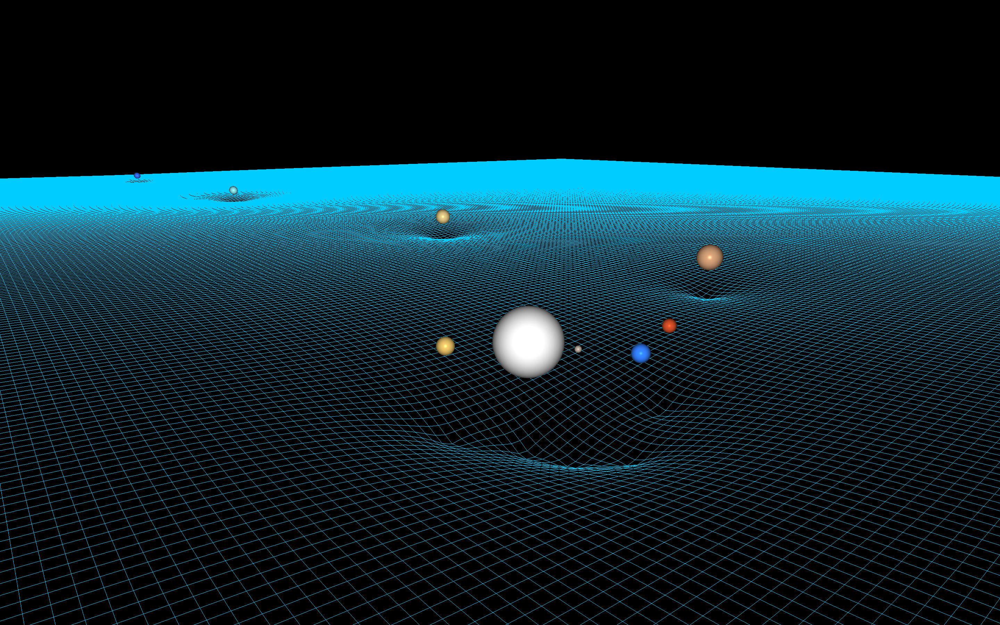

# N-Body Gravitational Simulation



A 3D gravitational simulation written in Java, built as a self-directed learning project to explore Newtonian mechanics, numerical integration, 3D rendering and OpenGL.

---

## About

This project simulates the gravitational interaction between multiple bodies in 3D space using Newton's law of universal gravitation. Each body exerts a force on every other body; positions and velocities are updated using the **Leapfrog algorithm** — a time-reversible, symplectic integrator that conserves energy well over long simulation runs.

The simulation is rendered in real time via **OpenGL (Core Profile 3.3)** using LWJGL, with a Phong lighting model and a deformable spacetime grid visualizing gravitational potential.

---

## Architecture

```
src/main/java/com/gravitysim/
├── core/
│   ├── Body.java           # Data: position, velocity, acceleration, mass, radius
│   ├── SimBody.java        # Pairs a Body with its BodyRenderer
│   ├── Simulation.java     # Main loop: applies forces and integrates motion
│   └── Vector3D.java       # Immutable 3D vector math
├── physics/
│   └── Gravity.java        # Pairwise gravitational force (Newton's law)
└── renderer/
    ├── Renderer.java            # Coordinator / Singleton — owns the render loop
    ├── BodyRenderer.java        # VAO/VBO/EBO, sphere mesh, model matrix per body
    ├── ShaderProgram.java       # GLSL compilation and linking
    ├── SpacetimeGrid.java       # Deformable XZ-plane grid (gravitational potential)
    └── Camera.java              # View and projection matrices
```

### Key design decisions

- **`Vector3D` is immutable** — all operations return a new vector, avoiding accidental mutation
- **`Gravity.calculateForce(a, b)`** returns the force on `a` from `b`; Newton's third law is applied via inversion
- **Leapfrog integration** — velocity and position are updated in a staggered ("leapfrog") pattern; time-reversible and symplectic, which gives significantly better long-term energy conservation than Euler methods
- **`BodyRenderer` per body** — each body owns its VAO/VBO/EBO and model matrix, keeping GPU resources explicit and isolated
- **MVP matrix system** via JOML (`Matrix4f`) — model, view, and projection matrices passed as uniforms to the vertex shader
- **Phong lighting** — ambient, diffuse and specular components computed in the fragment shader

---

## Build & Run

**Requirements:** Java 17+, Maven, macOS (Apple Silicon)

```bash
mvn clean compile
./run.sh
```

`run.sh` handles the `-XstartOnFirstThread` JVM flag required by GLFW on macOS and passes the correct LWJGL ARM64 natives.

---

## What I Learned

- **Newtonian gravity** — deriving force from the displacement vector; the same vector gives distance (`magnitude()`) and direction (`normalize()`)
- **Numerical integration** — symplectic Euler vs. Leapfrog and why time-reversibility matters for long-term orbit stability
- **OpenGL pipeline** — VAO/VBO/EBO setup, vertex attribute pointers, index-based drawing
- **GLSL shaders** — vertex shader transformations (MVP), fragment shader Phong model
- **3D math** — MVP matrices, perspective projection, view matrix via `lookAt`
- **LWJGL specifics** — `FloatBuffer` for GPU uploads, explicit cleanup of GPU resources, `glfwGetFramebufferSize` for Retina displays, `-XstartOnFirstThread` on macOS ARM64